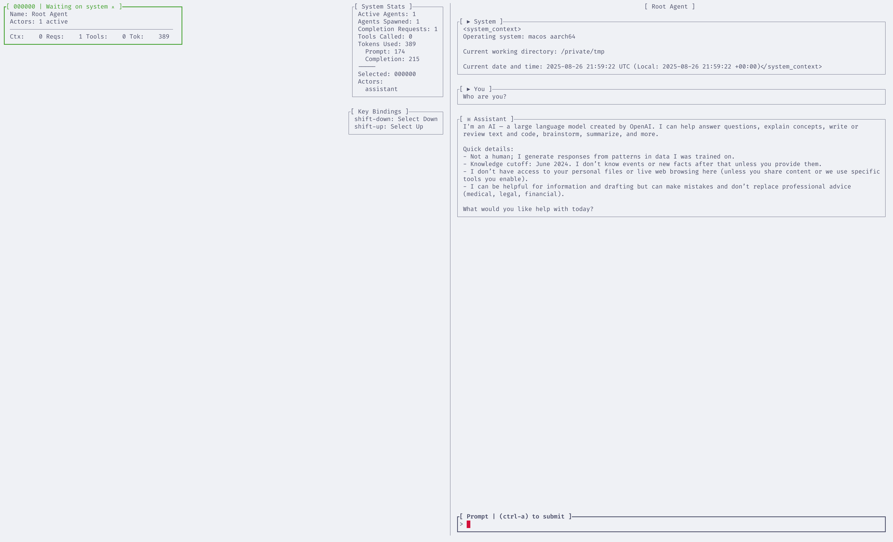

# Getting Started

This guide will walk you through running your first AI agent configuration with Wasmind.

## Verify Installation

First, let's make sure everything is installed correctly:

```bash
# Check that all tools are available
wasmind_cli --version
docker --version
cargo component --version

# Verify WASI target is installed (required for building actors)
rustup target list | grep wasm32-wasip1
```

You should see version numbers for all three commands and `wasm32-wasip1 (installed)` in the target list. If any command fails or the WASI target shows as not installed, go back to the [Installation](../installation.md) guide.

## Understanding the CLI

The Wasmind CLI provides helpful commands to get information about your setup:

```bash
# Get information about default locations and system details
wasmind_cli info

# Check a configuration file for errors
wasmind_cli check -c your-config.toml

# Clean cached actor builds
wasmind_cli clean
```

The `info` command shows you the default configuration location and other useful paths.

## Create Your First Configuration

Create a new file called `assistant.toml` with the following content:

```toml
# Simple Assistant Configuration
# A basic AI assistant for getting started with Wasmind

starting_actors = ["assistant"]

##############################
# TUI Config #################
##############################

[tui.dashboard.key_bindings]
"ctrl-c" = "Exit"
"esc" = "InterruptAgent"

[tui.chat.key_bindings]
"ctrl-a" = "Assist"

##############################
# Actors Config ##############
##############################

[actors.assistant]
source = { git = "https://github.com/SilasMarvin/wasmind", sub_dir = "actors/assistant" }

[actors.assistant.config]
model_name = "openai/gpt-5-mini"

##############################
# LiteLLM Config #############
##############################

[litellm]
image = "ghcr.io/berriai/litellm:main-latest"
port = 4000
container_name = "wasmind-litellm"

[[litellm.models]]
model_name = "openai/gpt-5-mini"

[litellm.models.litellm_params]
model = "openai/gpt-5-mini"
api_key = "os.environ/OPENAI_API_KEY"
```

Let's understand what you just created:

- **`starting_actors`** - When Wasmind starts, it automatically starts with these actors: the "assistant"
- **`[actors.assistant]`** - Defines where to find the assistant actor (fetched from GitHub)
- **`[actors.assistant.config]`** - Configures the assistant to use GPT-5-mini
- **`[tui.*]`** - Sets up keyboard shortcuts for the terminal interface
- **`[litellm]`** - Configures the AI model proxy that handles API calls

**What this creates**: A single AI agent that can have conversations but has no access to tools like file editing, command execution, or web browsing. It's a pure conversational assistant.

> **Want to customize?** The [Configuration](./configuration.md) guide explains how to modify these settings, add more actors, and create more complex setups.

## Run Your Configuration

Now run your configuration:

```bash
# Set your API key (if using OpenAI)
export OPENAI_API_KEY="your-api-key-here"

# Run your assistant configuration
wasmind_cli -c assistant.toml
```

> **Note**: You'll need an OpenAI API key set as the `OPENAI_API_KEY` environment variable. If you don't have one, you can modify the configuration to use other models from <a href="https://docs.litellm.ai/docs/providers" target="_blank">LiteLLM's supported providers</a>.

Wasmind will:
1. Start the LiteLLM proxy in Docker
2. Fetch and build the assistant actor from GitHub
3. Launch the terminal user interface (TUI)

## Understanding the TUI



The Wasmind TUI provides an interactive dashboard with a split view:

### Chat View
- **Purpose**: Interact directly with your AI assistant
- **Usage**: Type messages and press `Ctrl+A` to send them to the assistant
- **Key Features**: See conversation history, assistant responses, and any tool usage

### Graph View
- **Purpose**: Visualize agent relationships and message flow
- **Usage**: See how actors are connected and how messages flow between them
- **Key Features**: Real-time message visualization, actor hierarchy

> **Tip**: For advanced TUI configuration options like custom key bindings, see the wasmind_cli documentation.

## Try It Out

In the Chat view:
1. Type a message like "Hello! Can you help me understand what you can do?"
2. Press `Ctrl+A` to send it to the assistant
3. Watch the assistant respond in real-time

Since this is a basic assistant with no tools, it can have conversations but can't perform actions like running commands or editing files.

## What Just Happened?

When you ran `wasmind_cli -c assistant.toml`, here's exactly what happened:

1. **Parsed the configuration** - Read and validated your `assistant.toml` file
2. **Started LiteLLM proxy** - Launched the Docker container to handle AI model API calls
3. **Discovered and compiled actors** - Found the assistant actor source on GitHub, compiled it to WebAssembly
4. **Loaded starting actors** - Instantiated the actors listed in `starting_actors` (just "assistant" in this case)
5. **Launched the TUI** - Started the terminal user interface for you to interact with the system

The assistant actor is now running as a WebAssembly component, ready to receive messages and make API calls to GPT-5-mini through the LiteLLM proxy.

## Next Steps

Congratulations! You've successfully run your first Wasmind configuration. Here's where to go next:

### Learn About Configuration
Ready to customize your setup? The [Configuration](./configuration.md) guide covers:
- Understanding configuration file structure
- Adding more actors and capabilities
- Customizing TUI settings
- Working with different AI models

### Explore Complex Examples
Want to see what's possible? The [Examples](./examples.md) guide walks through:
- Multi-agent delegation networks
- Tool-enabled assistants
- Collaborative approval workflows
- Custom coordination patterns

### Understand Actor Types
Curious about the building blocks? The [Using Actors](./using-actors.md) guide explains:
- Different types of actors available
- How actors work together
- When to use each actor type
- Actor capabilities and limitations

### Build Your Own Actors
Want to extend Wasmind? Check out the [Developer Guide](../developer-guide/) to learn how to build custom actors and extend the system.
